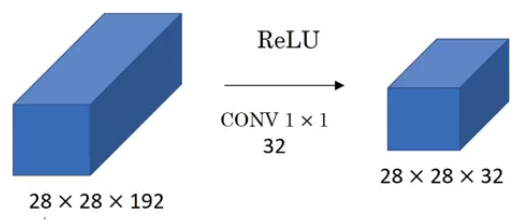

# Assignment 9: Advanced Convolution
**************************************************************************************************************************************************************

## Problem Staement :
  - Model should follow C1 C2 C3 C4 0 (No MaxPooling, but 3 convolutions, where the last one has a stride of 2 instead) 
  - Use Dilated kernels here instead of MP or strided convolution
  - One of the layer must use Depthwise Separable Convolution
  - One of the layer must use Dilated Convolution
  - Use GAP (compulsory):- add FC after GAP to target #of classes (optional)
  - Model should achieve 85%+ accuracy under 200,000 parameters with no epochs limit
  - Code should be modular.

**************************************************************************************************************************************************************

## Code Details

This repository contains following files:

- `model.py`: This script contains  model architectures and different covolution and utility functions.
  - `get_conv_block function seems to generate a sequence of convolutional layers along with optional normalization and activation layers. 
        - It takes several parameters:

            - conv_type: A list indicating the type of convolution at each stage. It can be "standard", "depthwise", or "dilated".
            - in_channels: Number of input channels to the first convolutional layer.
            - out_channels_list: A list of the number of output channels for each convolutional layer.
            - kernel_size_list: A list of kernel sizes for each convolutional layer.
            - stride_list: A list of stride values for each convolutional layer.
            - padding_list: A list of padding values for each convolutional layer.
            - dilation_list: A list of dilation values for each convolutional layer (relevant only for dilated convolutions).
            - activation_fn: Activation function to be used after each convolutional layer (defaults to ReLU).
            - normalization: Type of normalization layer to be used ('batch' or 'group').
            - number_of_groups: Number of groups for group normalization (optional).
            - last_layer: A boolean indicating whether this block is the last one in the network.
        
        - It first asserts that all the lists (out_channels_list, kernel_size_list, stride_list, padding_list) have the same length.
        - Then, it iterates over each layer defined by the input lists:
        - For the first layer, it creates a convolutional layer based on the specified type (conv_type) and appends it to the layers list.
        - For subsequent layers, it creates convolutional layers based on the previous layer's output channels and appends them to the layers list.
        - For each layer (except the last one if specified), it appends a normalization layer and an activation function (defaulting to ReLU) to the layers  list.
        - Finally, it constructs a nn.Sequential module from the layers list and returns it.

      - This function provides flexible way to generate convolutional blocks with various configurations of convolution types, normalization, and  activation functions.

- `training_utils.py`: This script contains functions to train the model on training and test dataset
- `utils.py`: This script contains functions to print out statistics, get the misclassified images amd different plots/graphs
- `S9-1_batch`: This script contains code to train model on CIFAR dataset with different types of colvolutions(like dilated and depthwise convolution).
   Also different augumentation strategies(cutout) is used for better inference.
- `dataset.py` : This script contains wrapper class to use albumentations library with PyTorch Dataset

## Some Concepts from Session:

### Normal Convolutional

- This is used as a normal feature extractor.

- This is found in Nvidia hardware and CNN code is optimized for 3x3 kernels

- Input: Blue colored single channel of 5x5

  Kernel: Dark blue colored single channel of 3x3

  Feature map: Green colored single channel of 3x3 

  When input channel is convolved with the kernel, feature map is created. This way convolution is used to extract features

- Below images showcase a convolution operation for single channel

  

- Below images showcase a convolution operation of 3 channels(RGB)

  

  Kernel should have number of channels equal to number of input channels

```python
# PyTorch Implementation
nn.Conv2d(in_channels=3, out_channels=32, stride=1, kernel_size=3, bias=False, padding=0)
```

**************************************************************************************************************************************************************

### Point Convolution

- This is used to combine features

- This is used to increase or decrease the number of channels in a layer

- Very often used in different state of art architecture like ResNet, InceptionNet

- Here, 1x1 is used to reduce the number of channels from 192 to 32. It combines the features from multiple channels to preserve the information



```python
# PyTorch Implementation
nn.Conv2d(in_channels=3, out_channels=32, stride=1, kernel_size=1)   # Increase number of channels
nn.Conv2d(in_channels=32, out_channels=10, stride=1, kernel_size=1)  # Decrease number of channels
```
**************************************************************************************************************************************************************

### Depthwise Separable Convolution Layer

- This is used toreduce number of parameters in a layer and also overall computation cost.

- As a feature extractor, it is 15-20% less efficient compared to the conventional convolution

- Instead of employing a kernel with the same number of channels as the input, individual input channels are convolved separately with single-channel   kernels. This is the key difference with normal convolution

- Subsequently, a 1x1 convolution with multiple channels is applied to blend the features and generate a feature map with multiple channels.


- Below animation shows the operation of depthwise separable convolutions


```python
# PyTorch Implementation
nn.Sequential(
nn.Conv2d(in_channels=3, out_channels=3, stride=1, groups=3, kernel_size=3, bias=False, padding=1),
nn.Conv2d(in_channels=3, out_channels=10, stride=1, kernel_size=1, bias=False, padding=0)
)
```
**************************************************************************************************************************************************************

### Dilated/Atrous Convolution Layer

- This is used to increase receptive field of the network exponentially

- This is used for dense predictions.

- Examples are semantic/panoptic segmentations, super-resolution, denoising, generative art, keypoint detection, pose estimation, etc

- This convolution is used to detect the feature continuity and therefore used after normal convolution layer. Exp: To detect tail of tail of cat belongs to cat mounth or body.

- Dilated convolution incorporates a dilated (expanded) kernel to capture a wider range of information from the input. It is particularly useful for capturing larger receptive fields without increasing the number of parameters or the amount of computation.

- In dilated convolution, the kernel is expanded by inserting gaps between the kernel elements, known as dilation. This dilation effectively increases the spacing between kernel elements and allows the kernel to cover a larger area of the input while still maintaining a relatively small kernel size. Refer Dilation image

- Output size = ((Input size−(kernel size−1)×(dilation rate−1)−1)/stride)+1
​
- Benefits:
  - Wider Receptive Field
  - Reduced Computational Cost
  - Multi-Scale Feature Learning : semantic segmentation and object detection.
 
- Input: Blue colored single channel of 7x7

  Kernel: Dark blue colored single channel of 3x3 with a dilation of 2

  Feature map: Green colored single channel of 3x3 

  When input channel is convolved with the such kernel, we get a receptive field of 5x5 instead of 3x3(as with normal convolution)


```python
# PyTorch Implementation
nn.Conv2d(in_channels=3, out_channels=32, stride=1, kernel_size=3, bias=False, padding=0, dilation=2)
```
**************************************************************************************************************************************************************

### Spatial Separable Convolution

- This is used to reduce total number of parameters

- This was highly used in different variants of Inception Networks as well as in MobileNets

- Now a days, it is not used becuase mobile phone hardware are powerful enough to handle normal convolutions


```python
# PyTorch Implementation
nn.Sequential(
nn.Conv2d(in_channels=3, out_channels=1, stride=1, kernel_size=(3, 1), bias=False, padding=0),
nn.Conv2d(in_channels=1, out_channels=32, stride=1, kernel_size=(1, 3), bias=False, padding=0)
)
```
**************************************************************************************************************************************************************

### Transpose Convolution

- This is used to increase channel size after convolution

- This is used to solve dense problems

- If we pad image by 2*2, it causes inefficiency. Therefore Image is expanded by pinch and zoom and then image is convolved. The  adjoining pixel are populated with mean value. 

- Below image The 3X3(blue color) image become 7X7(blue color) after pinch and zoom , which is convolved by 3X3(gray color) to get 5X5(green color)


```python
# PyTorch Implementation
nn.Sequential(nn.ConvTranspose2d(in_channels=1, out_channels=1, kernel_size=3, bias=False,
                                 stride=1, padding=0, output_padding=0))
```
**************************************************************************************************************************************************************

## Data Augumentation

- Albumentations is a Python library for image augmentation. Image augmentation is used in deep learning and computer vision tasks to increase the quality of trained models. 

- As the volume of training data increases for vision tasks, the improvement in performance follows a logarithmic pattern. In simpler terms, adding more data results in diminishing returns in terms of performance gain.

- To address overfitting in machine learning models trained on limited data, various techniques have been proposed. These include DropOut, Batch Normalization, L1/L2 regularization, and Layer normalization. These techniques are designed to prevent the model from memorizing the training data too closely, which can lead to poor generalization on unseen data. However, the effectiveness of these techniques diminishes when the amount of training data is limited. In other words, even with these techniques in place, the model may still struggle to generalize well if the dataset is small.

Below are some technique  used:

- Scale:
  - Scaling involves resizing an image while preserving its aspect ratio.
  - It can be done by either enlarging or shrinking the image.
  - This augmentation helps the model learn to recognize objects at different scales and distances.

- Translation:
  - Translation involves shifting an image along its x and y axes.
  - It creates new images by moving the pixels in different directions.
  - This augmentation simulates changes in the position of objects within the image.

- Rotation:
  - Rotation involves rotating an image by a certain angle around its center.
  - It introduces variations in the orientation of objects within the image.
  - This augmentation helps the model become invariant to changes in object rotation.

- Blurring:
  - Blurring involves applying a filter to an image to reduce its sharpness.
  - It simulates the effect of motion blur or out-of-focus camera settings.
  - This augmentation helps the model become robust to variations in image quality.

- Image Mirroring:
  - Image mirroring (or flipping) involves creating a mirror image of the original by flipping it horizontally or vertically.
  - It effectively doubles the size of the dataset and helps the model learn invariant features.

- Color Shifting / Whitening:
  - Color shifting involves changing the color distribution of an image.
  - It can include adjusting brightness, contrast, saturation, or applying color transforms.
  - This augmentation helps the model become robust to variations in lighting conditions and color distortions.

- CoarseDropout 
  - It introduces variations in the appearance of the images by removing chunks of information, similar to occlusions or missing data in real-world   scenarios. This helps the model become more robust and invariant to such variations during training.  
  - It can also serve as an effective regularization technique to prevent overfitting by adding noise to the training data.

**************************************************************************************************************************************************************

## Model Summary: 
```
----------------------------------------------------------------
        Layer (type)               Output Shape         Param #
================================================================
            Conv2d-1           [-1, 32, 32, 32]             864
       BatchNorm2d-2           [-1, 32, 32, 32]              64
              ReLU-3           [-1, 32, 32, 32]               0
            Conv2d-4           [-1, 32, 32, 32]           9,216
       BatchNorm2d-5           [-1, 32, 32, 32]              64
              ReLU-6           [-1, 32, 32, 32]               0
            Conv2d-7           [-1, 32, 15, 15]           9,216
       BatchNorm2d-8           [-1, 32, 15, 15]              64
              ReLU-9           [-1, 32, 15, 15]               0
           Conv2d-10           [-1, 38, 15, 15]          10,944
      BatchNorm2d-11           [-1, 38, 15, 15]              76
             ReLU-12           [-1, 38, 15, 15]               0
           Conv2d-13           [-1, 38, 15, 15]          12,996
      BatchNorm2d-14           [-1, 38, 15, 15]              76
             ReLU-15           [-1, 38, 15, 15]               0
           Conv2d-16             [-1, 38, 7, 7]          12,996
      BatchNorm2d-17             [-1, 38, 7, 7]              76
             ReLU-18             [-1, 38, 7, 7]               0
           Conv2d-19             [-1, 38, 7, 7]             342
           Conv2d-20             [-1, 40, 7, 7]           1,520
      BatchNorm2d-21             [-1, 40, 7, 7]              80
             ReLU-22             [-1, 40, 7, 7]               0
           Conv2d-23             [-1, 40, 7, 7]          14,400
      BatchNorm2d-24             [-1, 40, 7, 7]              80
             ReLU-25             [-1, 40, 7, 7]               0
           Conv2d-26             [-1, 40, 3, 3]          14,400
      BatchNorm2d-27             [-1, 40, 3, 3]              80
             ReLU-28             [-1, 40, 3, 3]               0
           Conv2d-29             [-1, 64, 3, 3]          23,040
      BatchNorm2d-30             [-1, 64, 3, 3]             128
             ReLU-31             [-1, 64, 3, 3]               0
           Conv2d-32             [-1, 64, 3, 3]          36,864
      BatchNorm2d-33             [-1, 64, 3, 3]             128
             ReLU-34             [-1, 64, 3, 3]               0
           Conv2d-35             [-1, 64, 3, 3]          36,864
      BatchNorm2d-36             [-1, 64, 3, 3]             128
             ReLU-37             [-1, 64, 3, 3]               0
AdaptiveAvgPool2d-38             [-1, 64, 1, 1]               0
           Conv2d-39             [-1, 10, 1, 1]             640
================================================================
Total params: 185,346
Trainable params: 185,346
Non-trainable params: 0
----------------------------------------------------------------
Input size (MB): 0.01
Forward/backward pass size (MB): 2.25
Params size (MB): 0.71
Estimated Total Size (MB): 2.97
----------------------------------------------------------------
```
**************************************************************************************************************************************************************

## Training logs:
```
Epoch 1
Train: Loss=1.8411 Batch_id=97 Accuracy=22.31: 100%|██████████| 98/98 [00:09<00:00, 10.34it/s]
Test set: Average loss: 1.7889, Accuracy: 3303/10000 (33.03%)

Epoch 2
Train: Loss=1.5272 Batch_id=97 Accuracy=37.70: 100%|██████████| 98/98 [00:08<00:00, 11.25it/s]
Test set: Average loss: 1.5088, Accuracy: 4390/10000 (43.90%)

Epoch 3
Train: Loss=1.3502 Batch_id=97 Accuracy=46.09: 100%|██████████| 98/98 [00:09<00:00,  9.97it/s]
Test set: Average loss: 1.3560, Accuracy: 5006/10000 (50.06%)

Epoch 4
Train: Loss=1.2708 Batch_id=97 Accuracy=50.72: 100%|██████████| 98/98 [00:10<00:00,  8.91it/s]
Test set: Average loss: 1.2204, Accuracy: 5587/10000 (55.87%)

Epoch 5
Train: Loss=1.1516 Batch_id=97 Accuracy=55.01: 100%|██████████| 98/98 [00:10<00:00,  9.79it/s]
Test set: Average loss: 1.1493, Accuracy: 5846/10000 (58.46%)

Epoch 6
Train: Loss=1.2218 Batch_id=97 Accuracy=58.70: 100%|██████████| 98/98 [00:09<00:00, 10.24it/s]
Test set: Average loss: 1.2725, Accuracy: 5606/10000 (56.06%)

Epoch 7
Train: Loss=0.9320 Batch_id=97 Accuracy=61.57: 100%|██████████| 98/98 [00:10<00:00,  9.42it/s]
Test set: Average loss: 1.0386, Accuracy: 6334/10000 (63.34%)

Epoch 8
Train: Loss=1.0131 Batch_id=97 Accuracy=63.50: 100%|██████████| 98/98 [00:10<00:00,  9.08it/s]
Test set: Average loss: 0.9393, Accuracy: 6706/10000 (67.06%)

Epoch 9
Train: Loss=0.9250 Batch_id=97 Accuracy=65.21: 100%|██████████| 98/98 [00:09<00:00,  9.82it/s]
Test set: Average loss: 0.8798, Accuracy: 6898/10000 (68.98%)

Epoch 10
Train: Loss=0.9259 Batch_id=97 Accuracy=67.73: 100%|██████████| 98/98 [00:08<00:00, 10.94it/s]
Test set: Average loss: 0.8328, Accuracy: 7101/10000 (71.01%)

Epoch 11
Train: Loss=0.8714 Batch_id=97 Accuracy=68.83: 100%|██████████| 98/98 [00:10<00:00,  9.77it/s]
Test set: Average loss: 0.9613, Accuracy: 6787/10000 (67.87%)

Epoch 12
Train: Loss=0.8657 Batch_id=97 Accuracy=70.30: 100%|██████████| 98/98 [00:10<00:00,  9.54it/s]
Test set: Average loss: 0.8363, Accuracy: 7155/10000 (71.55%)

Epoch 13
Train: Loss=0.6936 Batch_id=97 Accuracy=71.43: 100%|██████████| 98/98 [00:10<00:00,  9.63it/s]
Test set: Average loss: 0.7680, Accuracy: 7377/10000 (73.77%)

Epoch 14
Train: Loss=0.7402 Batch_id=97 Accuracy=72.45: 100%|██████████| 98/98 [00:08<00:00, 11.24it/s]
Test set: Average loss: 0.7542, Accuracy: 7408/10000 (74.08%)

Epoch 15
Train: Loss=0.7509 Batch_id=97 Accuracy=73.31: 100%|██████████| 98/98 [00:11<00:00,  8.37it/s]
Test set: Average loss: 0.7527, Accuracy: 7417/10000 (74.17%)

Epoch 16
Train: Loss=0.7315 Batch_id=97 Accuracy=74.14: 100%|██████████| 98/98 [00:10<00:00,  9.35it/s]
Test set: Average loss: 0.8312, Accuracy: 7158/10000 (71.58%)

Epoch 17
Train: Loss=0.7277 Batch_id=97 Accuracy=74.44: 100%|██████████| 98/98 [00:10<00:00,  9.48it/s]
Test set: Average loss: 0.8319, Accuracy: 7260/10000 (72.60%)

Epoch 18
Train: Loss=0.7517 Batch_id=97 Accuracy=75.28: 100%|██████████| 98/98 [00:08<00:00, 10.92it/s]
Test set: Average loss: 0.6922, Accuracy: 7643/10000 (76.43%)

Epoch 19
Train: Loss=0.7242 Batch_id=97 Accuracy=75.48: 100%|██████████| 98/98 [00:09<00:00, 10.55it/s]
Test set: Average loss: 0.7627, Accuracy: 7363/10000 (73.63%)

Epoch 20
Train: Loss=0.6403 Batch_id=97 Accuracy=76.35: 100%|██████████| 98/98 [00:10<00:00,  9.31it/s]
Test set: Average loss: 0.6997, Accuracy: 7655/10000 (76.55%)

Epoch 21
Train: Loss=0.7643 Batch_id=97 Accuracy=77.02: 100%|██████████| 98/98 [00:10<00:00,  9.48it/s]
Test set: Average loss: 0.6521, Accuracy: 7787/10000 (77.87%)

Epoch 22
Train: Loss=0.7389 Batch_id=97 Accuracy=77.40: 100%|██████████| 98/98 [00:10<00:00,  9.77it/s]
Test set: Average loss: 0.7077, Accuracy: 7578/10000 (75.78%)

Epoch 23
Train: Loss=0.6542 Batch_id=97 Accuracy=77.85: 100%|██████████| 98/98 [00:09<00:00, 10.66it/s]
Test set: Average loss: 0.7202, Accuracy: 7621/10000 (76.21%)

Epoch 24
Train: Loss=0.6245 Batch_id=97 Accuracy=78.17: 100%|██████████| 98/98 [00:09<00:00, 10.05it/s]
Test set: Average loss: 0.6349, Accuracy: 7786/10000 (77.86%)

Epoch 25
Train: Loss=0.6188 Batch_id=97 Accuracy=78.10: 100%|██████████| 98/98 [00:10<00:00,  9.60it/s]
Test set: Average loss: 0.8377, Accuracy: 7358/10000 (73.58%)

Epoch 26
Train: Loss=0.6359 Batch_id=97 Accuracy=78.91: 100%|██████████| 98/98 [00:10<00:00,  9.51it/s]
Test set: Average loss: 0.6122, Accuracy: 7925/10000 (79.25%)

Epoch 27
Train: Loss=0.6195 Batch_id=97 Accuracy=79.10: 100%|██████████| 98/98 [00:09<00:00, 10.41it/s]
Test set: Average loss: 0.5995, Accuracy: 7965/10000 (79.65%)

Epoch 28
Train: Loss=0.5838 Batch_id=97 Accuracy=79.29: 100%|██████████| 98/98 [00:09<00:00, 10.74it/s]
Test set: Average loss: 0.5877, Accuracy: 7978/10000 (79.78%)

Epoch 29
Train: Loss=0.5852 Batch_id=97 Accuracy=79.72: 100%|██████████| 98/98 [00:10<00:00,  9.19it/s]
Test set: Average loss: 0.6404, Accuracy: 7887/10000 (78.87%)

Epoch 30
Train: Loss=0.5674 Batch_id=97 Accuracy=80.04: 100%|██████████| 98/98 [00:10<00:00,  9.24it/s]
Test set: Average loss: 0.5626, Accuracy: 8077/10000 (80.77%)

Epoch 31
Train: Loss=0.5099 Batch_id=97 Accuracy=80.28: 100%|██████████| 98/98 [00:09<00:00,  9.85it/s]
Test set: Average loss: 0.6631, Accuracy: 7762/10000 (77.62%)

Epoch 32
Train: Loss=0.5184 Batch_id=97 Accuracy=80.38: 100%|██████████| 98/98 [00:09<00:00, 10.66it/s]
Test set: Average loss: 0.5601, Accuracy: 8091/10000 (80.91%)

Epoch 33
Train: Loss=0.6230 Batch_id=97 Accuracy=80.94: 100%|██████████| 98/98 [00:10<00:00,  9.58it/s]
Test set: Average loss: 0.5992, Accuracy: 8005/10000 (80.05%)

Epoch 34
Train: Loss=0.4386 Batch_id=97 Accuracy=80.93: 100%|██████████| 98/98 [00:10<00:00,  9.10it/s]
Test set: Average loss: 0.6371, Accuracy: 7927/10000 (79.27%)

Epoch 35
Train: Loss=0.6606 Batch_id=97 Accuracy=80.76: 100%|██████████| 98/98 [00:10<00:00,  9.69it/s]
Test set: Average loss: 0.6179, Accuracy: 7907/10000 (79.07%)

Epoch 36
Train: Loss=0.5581 Batch_id=97 Accuracy=81.24: 100%|██████████| 98/98 [00:09<00:00,  9.97it/s]
Test set: Average loss: 0.5724, Accuracy: 8082/10000 (80.82%)

Epoch 37
Train: Loss=0.5031 Batch_id=97 Accuracy=81.29: 100%|██████████| 98/98 [00:09<00:00, 10.07it/s]
Test set: Average loss: 0.5238, Accuracy: 8236/10000 (82.36%)

Epoch 38
Train: Loss=0.5866 Batch_id=97 Accuracy=82.15: 100%|██████████| 98/98 [00:10<00:00,  9.31it/s]
Test set: Average loss: 0.5464, Accuracy: 8160/10000 (81.60%)

Epoch 39
Train: Loss=0.5084 Batch_id=97 Accuracy=81.88: 100%|██████████| 98/98 [00:10<00:00,  9.66it/s]
Test set: Average loss: 0.7143, Accuracy: 7695/10000 (76.95%)

Epoch 40
Train: Loss=0.5830 Batch_id=97 Accuracy=81.80: 100%|██████████| 98/98 [00:10<00:00,  9.33it/s]
Test set: Average loss: 0.5786, Accuracy: 8077/10000 (80.77%)

Epoch 41
Train: Loss=0.4488 Batch_id=97 Accuracy=82.27: 100%|██████████| 98/98 [00:09<00:00,  9.88it/s]
Test set: Average loss: 0.5496, Accuracy: 8156/10000 (81.56%)

Epoch 42
Train: Loss=0.5035 Batch_id=97 Accuracy=82.41: 100%|██████████| 98/98 [00:09<00:00,  9.92it/s]
Test set: Average loss: 0.5421, Accuracy: 8173/10000 (81.73%)

Epoch 43
Train: Loss=0.5068 Batch_id=97 Accuracy=82.10: 100%|██████████| 98/98 [00:10<00:00,  9.14it/s]
Test set: Average loss: 0.6432, Accuracy: 7888/10000 (78.88%)

Epoch 44
Train: Loss=0.5541 Batch_id=97 Accuracy=82.57: 100%|██████████| 98/98 [00:10<00:00,  9.17it/s]
Test set: Average loss: 0.5436, Accuracy: 8176/10000 (81.76%)

Epoch 45
Train: Loss=0.5652 Batch_id=97 Accuracy=82.68: 100%|██████████| 98/98 [00:09<00:00, 10.73it/s]
Test set: Average loss: 0.5694, Accuracy: 8084/10000 (80.84%)

Epoch 46
Train: Loss=0.4783 Batch_id=97 Accuracy=82.97: 100%|██████████| 98/98 [00:09<00:00, 10.35it/s]
Test set: Average loss: 0.5290, Accuracy: 8228/10000 (82.28%)

Epoch 47
Train: Loss=0.4790 Batch_id=97 Accuracy=83.05: 100%|██████████| 98/98 [00:10<00:00,  9.47it/s]
Test set: Average loss: 0.5356, Accuracy: 8167/10000 (81.67%)

Epoch 48
Train: Loss=0.4530 Batch_id=97 Accuracy=83.21: 100%|██████████| 98/98 [00:10<00:00,  9.66it/s]
Test set: Average loss: 0.5319, Accuracy: 8230/10000 (82.30%)

Epoch 49
Train: Loss=0.5065 Batch_id=97 Accuracy=83.33: 100%|██████████| 98/98 [00:09<00:00,  9.99it/s]
Test set: Average loss: 0.5895, Accuracy: 8068/10000 (80.68%)

Epoch 50
Train: Loss=0.4219 Batch_id=97 Accuracy=83.31: 100%|██████████| 98/98 [00:08<00:00, 11.10it/s]
Test set: Average loss: 0.5334, Accuracy: 8218/10000 (82.18%)

Epoch 51
Train: Loss=0.5461 Batch_id=97 Accuracy=83.59: 100%|██████████| 98/98 [00:10<00:00,  9.79it/s]
Test set: Average loss: 0.5703, Accuracy: 8135/10000 (81.35%)

Epoch 52
Train: Loss=0.4804 Batch_id=97 Accuracy=84.06: 100%|██████████| 98/98 [00:10<00:00,  9.55it/s]
Test set: Average loss: 0.5143, Accuracy: 8309/10000 (83.09%)

Epoch 53
Train: Loss=0.5598 Batch_id=97 Accuracy=84.16: 100%|██████████| 98/98 [00:10<00:00,  9.58it/s]
Test set: Average loss: 0.5452, Accuracy: 8216/10000 (82.16%)

Epoch 54
Train: Loss=0.4505 Batch_id=97 Accuracy=83.95: 100%|██████████| 98/98 [00:08<00:00, 10.90it/s]
Test set: Average loss: 0.5463, Accuracy: 8217/10000 (82.17%)

Epoch 55
Train: Loss=0.4731 Batch_id=97 Accuracy=84.16: 100%|██████████| 98/98 [00:09<00:00, 10.18it/s]
Test set: Average loss: 0.4936, Accuracy: 8338/10000 (83.38%)

Epoch 56
Train: Loss=0.4152 Batch_id=97 Accuracy=83.92: 100%|██████████| 98/98 [00:10<00:00,  8.91it/s]
Test set: Average loss: 0.5007, Accuracy: 8281/10000 (82.81%)

Epoch 57
Train: Loss=0.4810 Batch_id=97 Accuracy=84.42: 100%|██████████| 98/98 [00:10<00:00,  9.38it/s]
Test set: Average loss: 0.4803, Accuracy: 8383/10000 (83.83%)

Epoch 58
Train: Loss=0.4838 Batch_id=97 Accuracy=84.44: 100%|██████████| 98/98 [00:10<00:00,  9.58it/s]
Test set: Average loss: 0.4958, Accuracy: 8376/10000 (83.76%)

Epoch 59
Train: Loss=0.4588 Batch_id=97 Accuracy=84.60: 100%|██████████| 98/98 [00:08<00:00, 11.32it/s]
Test set: Average loss: 0.4737, Accuracy: 8434/10000 (84.34%)

Epoch 60
Train: Loss=0.4312 Batch_id=97 Accuracy=84.65: 100%|██████████| 98/98 [00:09<00:00, 10.09it/s]
Test set: Average loss: 0.4832, Accuracy: 8383/10000 (83.83%)

Epoch 61
Train: Loss=0.4743 Batch_id=97 Accuracy=84.57: 100%|██████████| 98/98 [00:10<00:00,  9.67it/s]
Test set: Average loss: 0.4859, Accuracy: 8393/10000 (83.93%)

Epoch 62
Train: Loss=0.4160 Batch_id=97 Accuracy=85.03: 100%|██████████| 98/98 [00:09<00:00,  9.85it/s]
Test set: Average loss: 0.5260, Accuracy: 8244/10000 (82.44%)

Epoch 63
Train: Loss=0.4116 Batch_id=97 Accuracy=85.28: 100%|██████████| 98/98 [00:08<00:00, 11.00it/s]
Test set: Average loss: 0.5206, Accuracy: 8309/10000 (83.09%)

Epoch 64
Train: Loss=0.4463 Batch_id=97 Accuracy=85.10: 100%|██████████| 98/98 [00:09<00:00, 10.51it/s]
Test set: Average loss: 0.5023, Accuracy: 8374/10000 (83.74%)

Epoch 65
Train: Loss=0.4164 Batch_id=97 Accuracy=85.38: 100%|██████████| 98/98 [00:10<00:00,  9.79it/s]
Test set: Average loss: 0.5446, Accuracy: 8239/10000 (82.39%)

Epoch 66
Train: Loss=0.4325 Batch_id=97 Accuracy=85.56: 100%|██████████| 98/98 [00:10<00:00,  9.72it/s]
Test set: Average loss: 0.4689, Accuracy: 8478/10000 (84.78%)

Epoch 67
Train: Loss=0.3633 Batch_id=97 Accuracy=85.54: 100%|██████████| 98/98 [00:09<00:00, 10.30it/s]
Test set: Average loss: 0.4769, Accuracy: 8422/10000 (84.22%)

Epoch 68
Train: Loss=0.3171 Batch_id=97 Accuracy=85.46: 100%|██████████| 98/98 [00:08<00:00, 11.32it/s]
Test set: Average loss: 0.4916, Accuracy: 8393/10000 (83.93%)

Epoch 69
Train: Loss=0.4737 Batch_id=97 Accuracy=85.81: 100%|██████████| 98/98 [00:10<00:00,  9.74it/s]
Test set: Average loss: 0.4518, Accuracy: 8522/10000 (85.22%)

Epoch 70
Train: Loss=0.3412 Batch_id=97 Accuracy=86.23: 100%|██████████| 98/98 [00:09<00:00,  9.84it/s]
Test set: Average loss: 0.4850, Accuracy: 8426/10000 (84.26%)

Epoch 71
Train: Loss=0.4185 Batch_id=97 Accuracy=86.03: 100%|██████████| 98/98 [00:09<00:00,  9.86it/s]
Test set: Average loss: 0.4948, Accuracy: 8379/10000 (83.79%)

Epoch 72
Train: Loss=0.3693 Batch_id=97 Accuracy=86.38: 100%|██████████| 98/98 [00:08<00:00, 11.19it/s]
Test set: Average loss: 0.4590, Accuracy: 8479/10000 (84.79%)

Epoch 73
Train: Loss=0.3486 Batch_id=97 Accuracy=86.49: 100%|██████████| 98/98 [00:09<00:00, 10.22it/s]
Test set: Average loss: 0.5021, Accuracy: 8419/10000 (84.19%)

Epoch 74
Train: Loss=0.3922 Batch_id=97 Accuracy=86.52: 100%|██████████| 98/98 [00:10<00:00,  9.76it/s]
Test set: Average loss: 0.4478, Accuracy: 8544/10000 (85.44%)

Epoch 75
Train: Loss=0.4967 Batch_id=97 Accuracy=86.61: 100%|██████████| 98/98 [00:10<00:00,  9.60it/s]
Test set: Average loss: 0.4604, Accuracy: 8514/10000 (85.14%)

Epoch 76
Train: Loss=0.4014 Batch_id=97 Accuracy=86.79: 100%|██████████| 98/98 [00:08<00:00, 11.06it/s]
Test set: Average loss: 0.4393, Accuracy: 8570/10000 (85.70%)

Epoch 77
Train: Loss=0.2886 Batch_id=97 Accuracy=87.15: 100%|██████████| 98/98 [00:09<00:00, 10.79it/s]
Test set: Average loss: 0.4457, Accuracy: 8528/10000 (85.28%)

Epoch 78
Train: Loss=0.3980 Batch_id=97 Accuracy=87.10: 100%|██████████| 98/98 [00:10<00:00,  9.14it/s]
Test set: Average loss: 0.4718, Accuracy: 8488/10000 (84.88%)

Epoch 79
Train: Loss=0.3003 Batch_id=97 Accuracy=87.33: 100%|██████████| 98/98 [00:10<00:00,  9.69it/s]
Test set: Average loss: 0.4418, Accuracy: 8554/10000 (85.54%)

Epoch 80
Train: Loss=0.3498 Batch_id=97 Accuracy=87.65: 100%|██████████| 98/98 [00:09<00:00, 10.06it/s]
Test set: Average loss: 0.4708, Accuracy: 8489/10000 (84.89%)

Epoch 81
Train: Loss=0.3910 Batch_id=97 Accuracy=87.77: 100%|██████████| 98/98 [00:08<00:00, 10.97it/s]
Test set: Average loss: 0.4514, Accuracy: 8507/10000 (85.07%)

Epoch 82
Train: Loss=0.3004 Batch_id=97 Accuracy=87.91: 100%|██████████| 98/98 [00:09<00:00,  9.91it/s]
Test set: Average loss: 0.4364, Accuracy: 8591/10000 (85.91%)

Epoch 83
Train: Loss=0.3038 Batch_id=97 Accuracy=87.91: 100%|██████████| 98/98 [00:10<00:00,  9.73it/s]
Test set: Average loss: 0.4437, Accuracy: 8621/10000 (86.21%)

Epoch 84
Train: Loss=0.3168 Batch_id=97 Accuracy=88.29: 100%|██████████| 98/98 [00:09<00:00,  9.96it/s]
Test set: Average loss: 0.4612, Accuracy: 8526/10000 (85.26%)

Epoch 85
Train: Loss=0.3016 Batch_id=97 Accuracy=88.41: 100%|██████████| 98/98 [00:08<00:00, 11.45it/s]
Test set: Average loss: 0.4270, Accuracy: 8629/10000 (86.29%)

Epoch 86
Train: Loss=0.3222 Batch_id=97 Accuracy=88.51: 100%|██████████| 98/98 [00:10<00:00,  9.70it/s]
Test set: Average loss: 0.4327, Accuracy: 8617/10000 (86.17%)

Epoch 87
Train: Loss=0.3347 Batch_id=97 Accuracy=88.66: 100%|██████████| 98/98 [00:10<00:00,  9.70it/s]
Test set: Average loss: 0.4210, Accuracy: 8652/10000 (86.52%)

Epoch 88
Train: Loss=0.3520 Batch_id=97 Accuracy=88.95: 100%|██████████| 98/98 [00:09<00:00,  9.81it/s]
Test set: Average loss: 0.4221, Accuracy: 8652/10000 (86.52%)

Epoch 89
Train: Loss=0.3130 Batch_id=97 Accuracy=89.06: 100%|██████████| 98/98 [00:08<00:00, 11.09it/s]
Test set: Average loss: 0.4129, Accuracy: 8687/10000 (86.87%)

Epoch 90
Train: Loss=0.3205 Batch_id=97 Accuracy=89.23: 100%|██████████| 98/98 [00:09<00:00, 10.44it/s]
Test set: Average loss: 0.4214, Accuracy: 8685/10000 (86.85%)

Epoch 91
Train: Loss=0.3715 Batch_id=97 Accuracy=89.34: 100%|██████████| 98/98 [00:10<00:00,  9.79it/s]
Test set: Average loss: 0.4168, Accuracy: 8691/10000 (86.91%)

Epoch 92
Train: Loss=0.3792 Batch_id=97 Accuracy=89.49: 100%|██████████| 98/98 [00:10<00:00,  9.62it/s]
Test set: Average loss: 0.4154, Accuracy: 8671/10000 (86.71%)

Epoch 93
Train: Loss=0.2948 Batch_id=97 Accuracy=89.63: 100%|██████████| 98/98 [00:09<00:00, 10.69it/s]
Test set: Average loss: 0.4152, Accuracy: 8690/10000 (86.90%)

Epoch 94
Train: Loss=0.2706 Batch_id=97 Accuracy=89.50: 100%|██████████| 98/98 [00:08<00:00, 10.97it/s]
Test set: Average loss: 0.4180, Accuracy: 8680/10000 (86.80%)

Epoch 95
Train: Loss=0.2933 Batch_id=97 Accuracy=89.97: 100%|██████████| 98/98 [00:09<00:00,  9.85it/s]
Test set: Average loss: 0.4144, Accuracy: 8696/10000 (86.96%)

Epoch 96
Train: Loss=0.3318 Batch_id=97 Accuracy=90.06: 100%|██████████| 98/98 [00:10<00:00,  9.76it/s]
Test set: Average loss: 0.4107, Accuracy: 8721/10000 (87.21%)

Epoch 97
Train: Loss=0.2926 Batch_id=97 Accuracy=89.76: 100%|██████████| 98/98 [00:09<00:00,  9.98it/s]
Test set: Average loss: 0.4112, Accuracy: 8710/10000 (87.10%)

Epoch 98
Train: Loss=0.2842 Batch_id=97 Accuracy=90.05: 100%|██████████| 98/98 [00:08<00:00, 11.01it/s]
Test set: Average loss: 0.4084, Accuracy: 8716/10000 (87.16%)

Epoch 99
Train: Loss=0.2826 Batch_id=97 Accuracy=89.72: 100%|██████████| 98/98 [00:10<00:00,  8.98it/s]
Test set: Average loss: 0.4093, Accuracy: 8718/10000 (87.18%)

Epoch 100
Train: Loss=0.3354 Batch_id=97 Accuracy=90.08: 100%|██████████| 98/98 [00:10<00:00,  9.73it/s]
Test set: Average loss: 0.4091, Accuracy: 8712/10000 (87.12%)
```
**************************************************************************************************************************************************************
